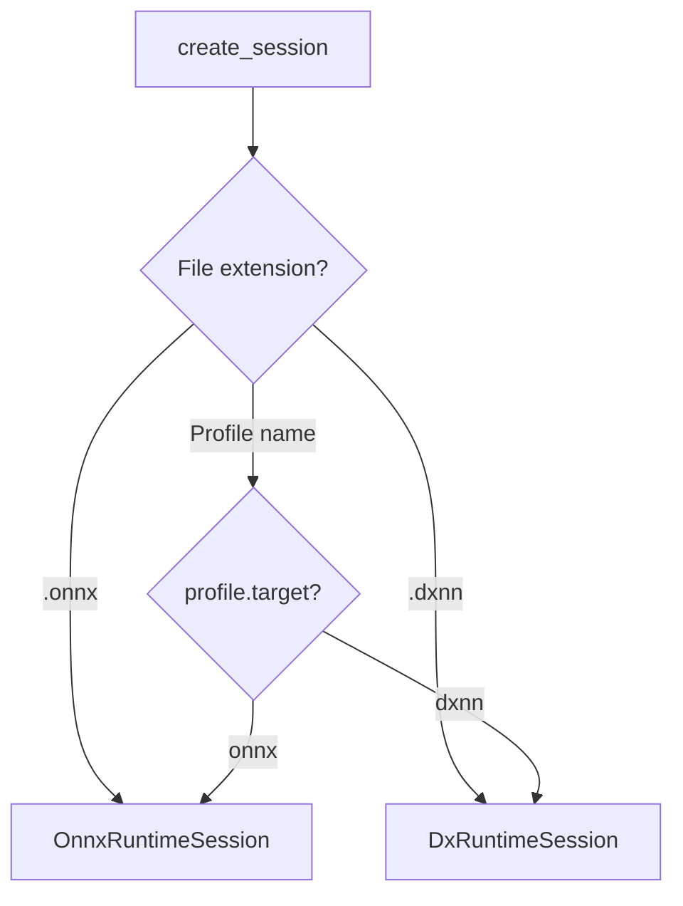

# Session

Session is a runtime interface for performing model inference. It supports two backends: ONNX Runtime and DxRuntime (NPU).

**Module:** `dx_modelzoo.session`

## SessionBase

Abstract base class that all sessions inherit from.

```python
class SessionBase(ABC):
    def __init__(self, path: str, device_count: int = 1)

    @abstractmethod
    def run(self, inputs: np.ndarray) -> list[np.ndarray]
        """Synchronous inference"""

    def run_async(self, inputs: np.ndarray, **kwargs) -> int
        """Asynchronous inference request → returns job_id"""

    def wait(self, job_id: int) -> list[np.ndarray]
        """Wait for asynchronous inference result"""

    def close(self) -> None
        """Release session resources"""

    def __enter__(self): ...
    def __exit__(self, ...): ...
```

### Attributes

| Attribute | Type | Description |
|-----------|------|-------------|
| `path` | `str` | Path to the model file |
| `device_count` | `int` | Number of devices to use |

### Context Manager

```python
with OnnxRuntimeSession("model.onnx") as session:
    output = session.run(input_tensor)
# close() is called automatically
```

## OnnxRuntimeSession

Inference session based on ONNX Runtime.

**Module:** `dx_modelzoo.session.onnx_session`

```python
class OnnxRuntimeSession(SessionBase):
    def __init__(self, path: str)
    def run(self, inputs: np.ndarray) -> list[np.ndarray]
    def run_async(self, inputs: np.ndarray, **kwargs) -> int
    def wait(self, job_id: int) -> list[np.ndarray]
```

### Features

- Automatically detects CUDA availability for GPU inference
- `run_async` is based on `ThreadPoolExecutor`
- Configurable `batch_size` (YAML `profiles.onnx.runtime.batch_size`)

### Usage Example

```python
from dx_modelzoo.session.onnx_session import OnnxRuntimeSession

session = OnnxRuntimeSession("resnet18.onnx")

# Synchronous inference
import numpy as np
input_tensor = np.random.randn(1, 3, 224, 224).astype(np.float32)
outputs = session.run(input_tensor)
# outputs: list[np.ndarray]

session.close()
```

## DxRuntimeSession

Inference session based on the DeepX NPU runtime.

**Module:** `dx_modelzoo.session.dx_session`

```python
class DxRuntimeSession(SessionBase):
    def __init__(self, path: str, device: Union[int, str, list[int], list[str]] = None)
    def run(self, inputs: np.ndarray) -> list[np.ndarray]
    def run_async(self, inputs: np.ndarray, **kwargs) -> int
    def wait(self, job_id: int) -> list[np.ndarray]
```

### Attributes

| Attribute | Type | Description |
|-----------|------|-------------|
| `dtype` | `list[dtype]` | Model input data types (extracted from InferenceEngine) |

### Features

- Uses the `dx_engine` library
- Native support for asynchronous inference
- Device selection: constructor `device` parameter or `DXNN_DEVICES` environment variable
- Fixed `batch_size=1`

### Usage Example

```python
from dx_modelzoo.session.dx_session import DxRuntimeSession

# Use device 0
session = DxRuntimeSession("model.dxnn", device=0)

# Asynchronous inference
job_id = session.run_async(input_tensor)
outputs = session.wait(job_id)

session.close()
```

!!! info "Device Selection"
    ```python
    # Specify via constructor
    session = DxRuntimeSession("model.dxnn", device=0)
    session = DxRuntimeSession("model.dxnn", device=[0, 1])  # Multi-device

    # Specify via environment variable
    # export DXNN_DEVICES=0,1
    session = DxRuntimeSession("model.dxnn")
    ```

## Session Factory

A factory function that automatically creates the appropriate session based on profile information.

**Module:** `dx_modelzoo.session.factory`

```python
def create_session(
    model_or_profile: str,
    *,
    builder: Optional[object] = None,
    device: Optional[Union[int, str, list]] = None,
) -> SessionBase
```

| Parameter | Type | Description |
|-----------|------|-------------|
| `model_or_profile` | `str` | Model file path or profile name |
| `builder` | `object \| None` | ModelBuilder instance (for profile resolution) |
| `device` | `int \| str \| list \| None` | Device specification |

### How It Works



### Automatic Download

If the `DXMZ_MODEL_URL` environment variable is set, the model file is automatically downloaded when it is not available locally:

```bash
export DXMZ_MODEL_URL=https://models.example.com/modelzoo
```

```python
# Downloads automatically if file is not found
session = create_session("onnx", builder=builder)
# → Downloads https://models.example.com/modelzoo/resnet50_224x224/resnet50_224x224.onnx
```

!!! warning "Network Required"
    Automatic download only works when `DXMZ_MODEL_URL` is set and the model file is not available locally. In offline environments, model files must be prepared in advance.

## Sync vs Async Comparison

=== "Sync"

    ```python
    session = OnnxRuntimeSession("model.onnx")
    output = session.run(input_tensor)  # Blocks until result is returned
    ```

    - Simple and intuitive
    - Runs only one inference at a time

=== "Async"

    ```python
    session = DxRuntimeSession("model.dxnn")

    # Inference requests (non-blocking)
    job1 = session.run_async(input1)
    job2 = session.run_async(input2)

    # Wait for results
    output1 = session.wait(job1)
    output2 = session.wait(job2)
    ```

    - High throughput through pipeline optimization
    - Overlaps data loading and inference on the NPU

## Runtime Configuration

Runtime options are defined in
`dx_modelzoo.session.runtime_config` and are built from the YAML
`profiles.<name>.runtime` block before a session is created.

### `RuntimeConfig`

Base dataclass shared by all backends.

```python
@dataclass
class RuntimeConfig:
    device: Any = None
    batch_size: int = 1
    async_mode: Optional[bool] = None
```

| Field | Description |
|-------|-------------|
| `device` | Device selection (`cpu`/`gpu` for ONNX, device IDs for DXNN) |
| `batch_size` | Evaluation batch size carried from YAML runtime config |
| `async_mode` | Explicit async override from YAML `runtime.async` |

`RuntimeConfig.use_async` resolves `async_mode` to the backend default when the
YAML omits `runtime.async`.

### `OnnxRuntimeConfig`

ONNX Runtime backend config.

```python
@dataclass
class OnnxRuntimeConfig(RuntimeConfig):
    ASYNC_DEFAULT = False
```

- Default async mode: `False`
- Used by `OnnxRuntimeSession`

### `DxnnRuntimeConfig`

DXNN backend config.

```python
@dataclass
class DxnnRuntimeConfig(RuntimeConfig):
    ASYNC_DEFAULT = True
    buffer_count: Optional[int] = None
    use_ort: bool = True
```

| Field | Description |
|-------|-------------|
| `buffer_count` | Engine I/O buffer count from YAML `runtime.buffer_count` |
| `use_ort` | Run unsupported ops on ONNX Runtime via YAML `runtime.use_ort` |

- Default async mode: `True`
- Used by `DxRuntimeSession`

### YAML Mapping

```yaml
profiles:
  onnx:
    target: onnx
    runtime:
      device: gpu
      batch_size: 4
      async: false

  q-lite:
    target: dxnn
    runtime:
      device: 0
      async: true
      buffer_count: 6
      use_ort: true
```

This maps to:

- `target: onnx` → `OnnxRuntimeConfig`
- `target: dxnn` → `DxnnRuntimeConfig`
- `runtime.async` → `async_mode`
- `runtime.buffer_count` / `runtime.use_ort` → DXNN-only fields

## Environment Variables

| Variable | Description | Example |
|----------|-------------|---------|
| `DXMZ_MODEL_URL` | URL for automatic model download | `https://models.example.com/modelzoo` |
| `DXNN_DEVICES` | DxRuntime devices (comma-separated) | `0,1` |

## Integration with ModelBuilder

Typically, sessions are not created directly but through `ModelBuilder`:

```python
from dx_modelzoo.loader.model_builder import ModelBuilder

builder = ModelBuilder("resnet50_224x224.yaml")

# Automatically creates the appropriate session for the profile
session = builder.build_session("onnx")      # → OnnxRuntimeSession
session = builder.build_session("q-lite")    # → DxRuntimeSession

# Specify model file directly
session = builder.build_session("onnx", model_path="/path/to/model.onnx")
```
