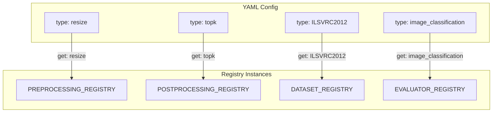
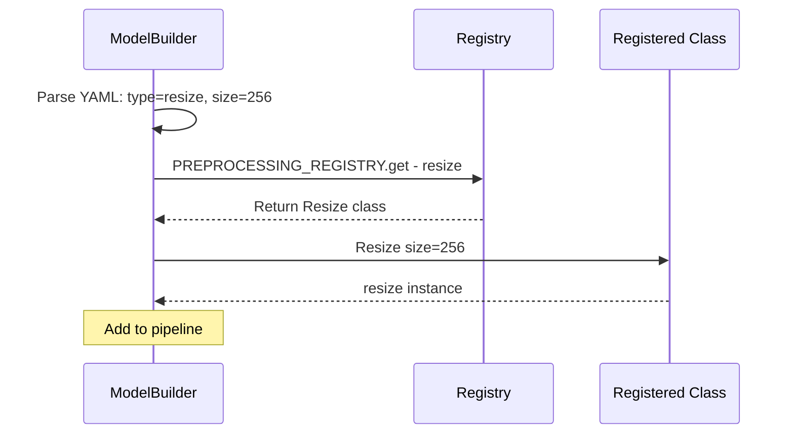
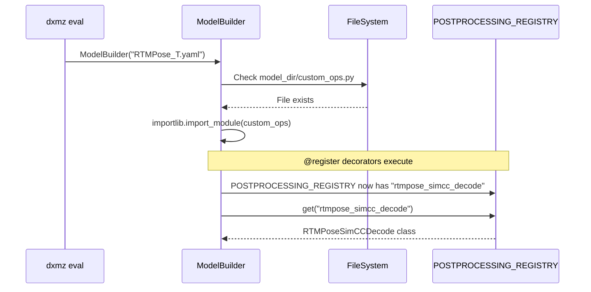

# Registry Pattern

DX ModelZoo uses the **Registry pattern** to manage all extensible components. The `type` field in YAML maps to classes registered in a Registry, enabling object creation from strings alone.

## Registry Class

`Registry` is a general-purpose class defined in `src/dx_modelzoo/common/registry.py`:

```python
class Registry:
    """General-purpose registry managing name-to-class mappings"""

    def __init__(self, name: str) -> None:
        self.name = name
        self._registry: dict[str, type] = {}

    def register(self, name_or_cls: Union[str, type, None] = None):
        """Register a class via decorator.

        Can be used as:
            @REGISTRY.register("name")  — explicit name
            @REGISTRY.register          — auto-derive from class name
        """
        if name_or_cls is None or isinstance(name_or_cls, str):
            explicit_name = name_or_cls
            def decorator(cls):
                key = explicit_name or _derive_name(cls)
                self._registry[key] = cls
                return cls
            return decorator
        else:
            cls = name_or_cls
            key = _derive_name(cls)
            self._registry[key] = cls
            return cls

    def get(self, name: str) -> type:
        """Look up a class by name"""
        if name not in self._registry:
            raise KeyError(f"{self.name}: '{name}' not found")
        return self._registry[name]

    def list(self) -> list[str]:
        """Return all registered names"""
        return list(self._registry.keys())

    def __contains__(self, name: str) -> bool:
        return name in self._registry

    def __len__(self) -> int:
        return len(self._registry)
```

## Core Registries

| Registry | Location | Purpose |
|----------|----------|---------|
| `PREPROCESSING_REGISTRY` | `preprocessing/__init__.py` | Preprocessing operations |
| `POSTPROCESSING_REGISTRY` | `postprocessing/__init__.py` | Postprocessing operations |
| `DATASET_REGISTRY` | `dataset/__init__.py` | Datasets |
| `EVALUATOR_REGISTRY` | `evaluator/__init__.py` | Evaluators |



## Registration

### Decorator Pattern (Standard)

```python
from dx_modelzoo.preprocessing import PREPROCESSING_REGISTRY

@PREPROCESSING_REGISTRY.register("my_op")
class MyOp:
    def __init__(self, param1: int = 10):
        self.param1 = param1

    def __call__(self, data):
        # Processing logic
        return data
```

### Usage in YAML

```yaml
preprocessing:
  - type: my_op          # Looks up MyOp class from the Registry
    param1: 20           # Instantiated as MyOp(param1=20)
```

## Build Process

When ModelBuilder parses YAML, it looks up classes through the Registry and creates instances:



### Pipeline Build Process

```python
# Simplified internal logic of ModelBuilder.build_preprocessing()
def build_preprocessing(self, profile_name, ...):
    steps = []
    for step_config in self.config["preprocessing"]:
        type_name = step_config["type"]
        params = {k: v for k, v in step_config.items() if k != "type"}

        # Look up class from Registry and instantiate with parameters
        cls = PREPROCESSING_REGISTRY.get(type_name)
        steps.append(cls(**params))

    return PreprocessingPipeline(steps, npu_mode=is_npu)
```

## Registered Types

### PREPROCESSING_REGISTRY

| Name | Class | Parameters |
|------|-------|------------|
| `resize` | `Resize` | `size`, `mode`, `interpolation` |
| `centercrop` | `CenterCrop` | `height`, `width` |
| `convertcolor` | `ConvertColor` | `form` |
| `div` | `Div` | `x` |
| `normalize` | `Normalize` | `mean`, `std` |
| `transpose` | `Transpose` | `axis` |
| `expanddim` | `ExpandDim` | `axis` |
| `bgr_to_y_channel` | `BgrToYChannel` | — |
| `bgr_to_y_channel_uint8` | `BgrToYChannelUint8` | — |
| `mul` | `Mul` | `x` |
| `add` | `Add` | `x` |
| `subtract` | `Subtract` | `x` |
| `totensor` | `ToTensor` | — |

### POSTPROCESSING_REGISTRY

| Name | Class | Purpose |
|------|-------|---------|
| `identity` | `Identity` | No postprocessing (passthrough) |
| `topk` | `TopK` | Top-k classes for classification |
| `nms` | `NMS` | Non-maximum suppression (detection) |
| `segmentation_argmax` | `SegmentationArgmax` | Segmentation argmax |

### DATASET_REGISTRY

| Name | Task |
|------|------|
| `ILSVRC2012` | Classification |
| `COCO` | Detection / Instance Segmentation |
| `PascalVOC2007` | Detection |
| `PascalVOC2012` | Segmentation |
| `Cityscapes` | Segmentation |
| `WiderFace` | Face Detection |
| `COCOPose` | Pose Estimation |
| `COCOPoseTopDown` | Pose Estimation (Top-Down) |
| `COCOPersonSeg` | Person Segmentation |
| `NYUDepthv2` | Depth Estimation |
| `LFW` | Face Recognition |
| `BSD68` / `BSD100` / `CBSD68` | Super Resolution / Denoising |
| `LOL` | Low-light Enhancement |
| `ADE20K` | Segmentation |
| `DOTAv1` | Oriented Object Detection |
| `OxfordIIITPet` | Segmentation |
| `Market1501` | Person Re-ID |
| `PETA` | Pedestrian Attribute |
| `HandKeypoints` | Hand Landmark |
| `HandKeypointsDetection` | Hand Detection |

!!! tip "Listing Registered Types"
    ```python
    from dx_modelzoo.preprocessing import PREPROCESSING_REGISTRY
    print(PREPROCESSING_REGISTRY.list())
    # ['resize', 'centercrop', 'convertcolor', 'div', 'normalize', ...]
    ```

## Adding Custom Types

To add a new type, register it with the appropriate Registry using the `@register()` decorator:

```python
from dx_modelzoo.dataset import DATASET_REGISTRY

@DATASET_REGISTRY.register("my_dataset")
class MyDataset(DatasetBase):
    def __init__(self, data_dir: str):
        super().__init__(data_dir)
        # ...

    def __len__(self): ...
    def __getitem__(self, idx): ...
```

For more details, see the [Custom Model Guide](../guides/custom-models.md) and [Custom Dataset Guide](../guides/custom-datasets.md).

## Auto-Import via `custom_ops.py`

Model-specific postprocessing types don't need to be in the core `postprocessing/` package. Instead, they can be defined in a `custom_ops.py` file within the model's directory.

### How It Works



### Key Details

- **Location**: `custom_ops.py` must be in the same directory as the model YAML
- **Import timing**: Imported during `ModelBuilder.__init__()`, before YAML validation
- **Module naming**: Uses SHA1 hash of the file path to avoid module name collisions
- **Idempotent**: If the same file is already loaded, the import is skipped

```python
# ModelBuilder._import_custom_ops() (simplified)
def _import_custom_ops(self) -> None:
    custom_ops_path = self.model_dir / "custom_ops.py"
    if custom_ops_path.exists():
        module_key = hashlib.sha1(str(custom_ops_path.resolve()).encode()).hexdigest()[:12]
        module_name = f"custom_ops_{self.model_dir.name}_{module_key}"
        spec = importlib.util.spec_from_file_location(module_name, custom_ops_path)
        module = importlib.util.module_from_spec(spec)
        spec.loader.exec_module(module)
```
