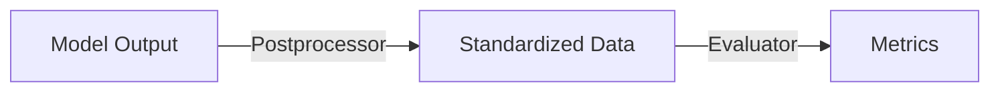

# Evaluator

The Evaluator in DX-ModelZoo is an abstract class that encapsulates model evaluation logic. It performs inference through a session and computes metrics.

**Module:** `dx_modelzoo.evaluator`

!!! note "See Also"
    - [Model Evaluation](../guides/evaluation.md) - Usage examples and evaluation workflow
    - [DataLoader](dataloader.md) - Data loading and batching
    - [Postprocessing](postprocessing.md) - Output transformation pipeline
    - [Session](session.md) - Inference session interface

## EvaluatorBase

The abstract base class that all evaluators inherit from.

### Constructor

```python
class EvaluatorBase(ABC):
    def __init__(
        self,
        session: SessionBase,
        dataset: DatasetBase,
        workers: int = 12,
        batch_size: int = 1,
    )
```

| Parameter | Type | Description |
|-----------|------|-------------|
| `session` | `SessionBase` | Inference session |
| `dataset` | `DatasetBase` | Evaluation dataset |
| `workers` | `int` | Number of DataLoader workers (default: 12) |
| `batch_size` | `int` | Batch size (default: 1) |

### Properties and Configuration Methods

```python
@property
def postprocessing(self) -> Callable
    """Currently configured postprocessing pipeline"""

def set_preprocessing(self, preprocessing) -> None
    """Set the preprocessing pipeline on the dataset"""

def set_postprocessing(self, postprocessing) -> None
    """Set the postprocessing pipeline"""

def make_loader(self) -> DataLoader
    """Create a DataLoader instance"""
```

**Context properties** (set externally):

| Property | Type | Description |
|----------|------|-------------|
| `model_name` | `str` | Model name |
| `dataset_name` | `str` | Dataset name |
| `profile_name` | `str` | Profile name |

### Running Evaluation

```python
def eval(self) -> dict
```

Runs evaluation and returns the results. Automatically selects Sync or Async mode based on whether the session supports asynchronous execution.

```python
results = evaluator.eval()
# {
#     "model": "resnet50_224x224",
#     "metrics": [{"name": "Top-1", "metric_value": 69.76}, ...],
#     "fps": 624.7,
#     "elapsed_time": 82
# }
```

## Abstract Methods (Must Be Implemented by Subclasses)

### `init_metrics`

```python
@abstractmethod
def init_metrics(self) -> Any
```

Initializes the metrics state. Called once before the evaluation loop begins.

```python
# Example: Classification
def init_metrics(self):
    return {"correct_top1": 0, "correct_top5": 0, "total": 0}
```

### `extract_inputs`

```python
@abstractmethod
def extract_inputs(self, batch_data: Any) -> Any
```

Extracts model inputs from batch data. Converts the batch returned by the DataLoader into the format expected by the session.

```python
# Example: Extract only images from an (images, labels) batch
def extract_inputs(self, batch_data):
    images, labels = batch_data
    return images
```

### `process_batch_result`

```python
@abstractmethod
def process_batch_result(
    self,
    batch_data: Any,
    output: Any,
    metrics_state: Any,
) -> Any
```

Processes the result of a single batch and updates the metrics state.

```python
# Example: Update Top-1/Top-5 accuracy
def process_batch_result(self, batch_data, output, metrics_state):
    images, labels = batch_data
    predictions = self.postprocessing(output)

    for pred, label in zip(predictions, labels):
        if pred["top1"] == label:
            metrics_state["correct_top1"] += 1
        if label in pred["top5"]:
            metrics_state["correct_top5"] += 1
        metrics_state["total"] += 1

    return metrics_state
```

### `compute_final_metrics`

```python
@abstractmethod
def compute_final_metrics(self, metrics_state: Any) -> dict
```

Computes the final metrics. Called once after the evaluation loop completes.

```python
# Example
def compute_final_metrics(self, metrics_state):
    total = metrics_state["total"]
    return {
        "metrics": [
            {"name": "Top-1", "metric_value": metrics_state["correct_top1"] / total * 100},
            {"name": "Top-5", "metric_value": metrics_state["correct_top5"] / total * 100},
        ]
    }
```

### `format_progress_desc`

```python
@abstractmethod
def format_progress_desc(self, metrics_state: Any, current_fps: float) -> str
```

Generates the string to display in the progress bar.

```python
# Example
def format_progress_desc(self, metrics_state, current_fps):
    total = metrics_state["total"] or 1
    acc = metrics_state["correct_top1"] / total * 100
    return f"Top-1: {acc:.2f}% | {current_fps:.1f} fps"
```

## Sync / Async Mode

The Evaluator automatically selects the mode based on the session type:

=== "Sync Mode"

    ```python
    def _eval_sync(self):
        metrics = self.init_metrics()
        for batch in dataloader:
            inputs = self.extract_inputs(batch)
            output = self.session.run(inputs)       # Synchronous inference
            metrics = self.process_batch_result(batch, output, metrics)
        return self.compute_final_metrics(metrics)
    ```

    - **Requirement:** OnnxRuntimeSession
    - Processes batches sequentially

=== "Async Mode"

    ```python
    def _eval_async(self):
        metrics = self.init_metrics()
        # Sliding window approach
        job_id = self.session.run_async(inputs)
        output = self.session.wait(job_id)
        metrics = self.process_batch_result(batch, output, metrics)
        return self.compute_final_metrics(metrics)
    ```

    - **Requirement:** DxRuntimeSession (NPU)
    - Maximizes throughput through pipeline optimization
    - Sliding window size of `workers × device_count`

## Built-in Evaluators

| Registry Name | Task | Key Metrics |
|---------------|------|-------------|
| `image_classification` | Classification | Top-1, Top-5 |
| `object_detection` | Object Detection | mAP |
| `oriented_object_detection` | Oriented Object Detection | mAP |
| `instance_segmentation` | Instance Segmentation | mAP |
| `zero_shot_instance_segmentation` | Zero-shot Instance Segmentation | mAP |
| `face_detection` | Face Detection | AP / FROC |
| `face_landmark` | Face Landmark | NME |
| `face_recognition` | Face Recognition | Accuracy |
| `face_attribute` | Face Attribute | Accuracy |
| `hand_detection` | Hand Detection | AP |
| `hand_landmark` | Hand Landmark | NME |
| `depth_estimation` | Depth Estimation | δ<1.25, RMSE |
| `image_denoising` | Image Denoising | PSNR |
| `low_light_enhancement` | Low-light Enhancement | PSNR, SSIM |
| `pose_estimation` | Pose Estimation | AP, AR |
| `pose_estimation_topdown` | Top-down Pose Estimation | AP, AR |
| `person_attribute` | Person Attribute | mA |
| `person_segmentation` | Person Segmentation | mIoU |
| `semantic_segmentation` | Semantic Segmentation | mIoU |
| `panoptic_driving_perception` | Panoptic Driving Perception | Detection + segmentation metrics |
| `visual_place_recognition` | Visual Place Recognition | Retrieval metrics |
| `keypoint_detection` | Keypoint Detection | Matching / repeatability metrics |
| `super_resolution` | Super Resolution | PSNR |
| `zero_shot_image_classification` | Zero-shot Image Classification | Top-1 |
| `object_pose_estimation` | Object Pose Estimation | ADD / ADD-S / PnP metrics |

## Design Principles

The Evaluator architecture follows a strict separation of concerns:

| Layer | Responsibility | Example |
|-------|---------------|---------|
| **Postprocessing** (`custom_ops.py`) | Convert raw model output → standardized format | Decode heatmap → keypoints |
| **Evaluator** | Consume standardized data → compute metrics | Keypoints → COCO AP |



**Rules:**
- Evaluators must **not** contain model-specific decoding logic.
- Model-specific transforms belong in `custom_ops.py` (registered with `POSTPROCESSING_REGISTRY`).
- Common operations (NMS, TopK) remain in the shared `postprocessing/` module.

### Standardized Data Formats

| Task | Postprocessor Output |
|------|---------------------|
| Feature Extraction | `(keypoints [N,2], descriptors [N,D])` |
| Pose Estimation (Top-Down) | `(keypoints [17,2], scores [17])` |
| Text Detection | `List[np.ndarray]` — polygons `[4,2]` |
| Text Recognition | `str` — decoded text |
| Face Detection (BlazeFace) | `np.ndarray [N, 5]` (x1, y1, x2, y2, score) |
| Instance Segmentation | `np.ndarray [N, H, W]` binary masks |
| Anomaly Detection | `float` — anomaly score |

## Writing a Custom Evaluator

```python
from dx_modelzoo.evaluator import EVALUATOR_REGISTRY, EvaluatorBase

@EVALUATOR_REGISTRY.register("my_evaluator")
class MyEvaluator(EvaluatorBase):
    def init_metrics(self):
        return {"total_error": 0.0, "count": 0}

    def extract_inputs(self, batch_data):
        inputs, targets = batch_data
        return inputs

    def process_batch_result(self, batch_data, output, metrics_state):
        _, targets = batch_data
        predictions = self.postprocessing(output)
        error = np.mean(np.abs(predictions - targets))
        metrics_state["total_error"] += error
        metrics_state["count"] += 1
        return metrics_state

    def compute_final_metrics(self, metrics_state):
        mae = metrics_state["total_error"] / metrics_state["count"]
        return {"metrics": [{"name": "MAE", "metric_value": mae}]}

    def format_progress_desc(self, metrics_state, current_fps):
        count = metrics_state["count"] or 1
        mae = metrics_state["total_error"] / count
        return f"MAE: {mae:.4f} | {current_fps:.1f} fps"
```

```yaml
evaluator:
  type: my_evaluator
```

!!! note "Keep Evaluators Pure"
    If your evaluator needs to decode model-specific output formats, put that logic in a `custom_ops.py` file in the model directory instead. The evaluator should only consume the decoded result and compute metrics.
