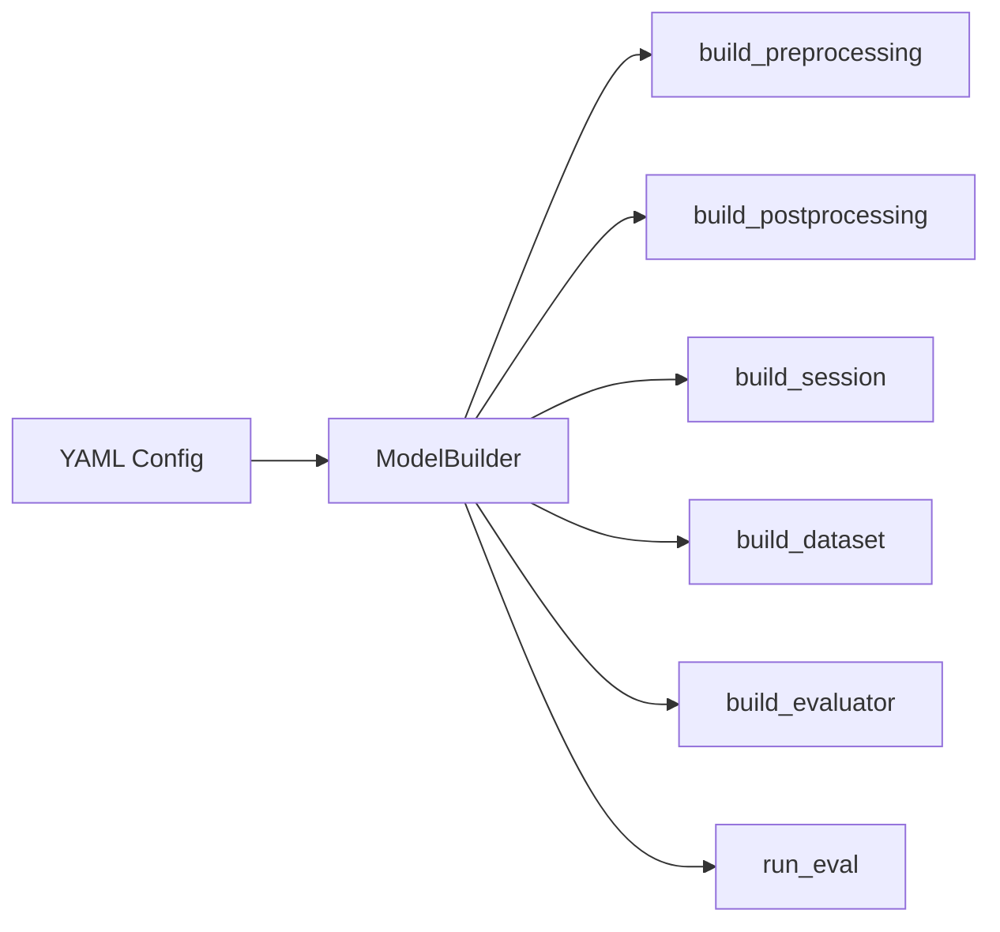

# ModelBuilder

`ModelBuilder` is the core class in DX-ModelZoo that parses YAML configuration files and creates all components required at runtime.

**Module:** `dx_modelzoo.loader.model_builder`

!!! note "See Also"
    - [YAML Configuration](../guides/yaml-config.md) - Complete YAML reference
    - [Model Evaluation](../guides/evaluation.md) - How to use ModelBuilder for evaluation
    - [Custom Models](../guides/custom-models.md) - Creating custom model configurations

## Overview



## Constructor

```python
ModelBuilder(yaml_path: Union[str, Path], resolve_env: bool = True)
```

| Parameter | Type | Description |
|-----------|------|-------------|
| `yaml_path` | `str \| Path` | Path to the YAML configuration file |
| `resolve_env` | `bool` | Whether to resolve environment variables (default: `True`) |

```python
from dx_modelzoo.loader.model_builder import ModelBuilder

builder = ModelBuilder("src/dx_modelzoo/models/cv/image_classification/resnet/resnet50_224x224.yaml")
```

## Properties

| Property | Type | Description |
|----------|------|-------------|
| `name` | `str` | Model name (`config["name"]`) |
| `inputs` | `list[dict]` | Input tensor definitions |
| `config` | `dict` | Complete parsed YAML configuration |
| `yaml_path` | `Path` | Path to the YAML file |
| `model_dir` | `Path` | Parent directory of the YAML file |
| `is_pipeline` | `bool` | True if YAML defines a multi-model pipeline |
| `pipeline_stages` | `list[str]` | Ordered list of pipeline stage names |
| `appendix` | `dict` | Model-specific overrides (npu_skip, label_preprocessing) |

```python
print(builder.name)      # "resnet50_224x224"
print(builder.inputs)    # [{"name": "input", "shape": [1,3,224,224], ...}]
```

## Methods

### `get_profile`

```python
def get_profile(self, profile_name: str) -> dict
```

Returns the profile configuration dictionary for the given profile name.

```python
profile = builder.get_profile("onnx")
# {"target": "onnx", "runtime": {"device": "gpu", "batch_size": 1}}
```

### `build_preprocessing`

```python
def build_preprocessing(
    self,
    profile_name: str,
    modal: Optional[str] = None,
    input_dtype: Optional[str] = None,
) -> PreprocessingPipeline
```

| Parameter | Type | Description |
|-----------|------|-------------|
| `profile_name` | `str` | Profile name (used to determine NPU mode) |
| `modal` | `str \| None` | Modality selection for multimodal models |
| `input_dtype` | `str \| None` | Input dtype override |

```python
preprocessing = builder.build_preprocessing("onnx")
# PreprocessingPipeline(steps=[Resize(...), CenterCrop(...), ...], npu_mode=False)

# NPU profile → arithmetic operations automatically skipped
preprocessing_npu = builder.build_preprocessing("q-lite")
# PreprocessingPipeline(steps=[Resize(...), CenterCrop(...)], npu_mode=True)
```

!!! note "Automatic NPU Mode Detection"
    When the profile's `target` is `dxnn`, `npu_mode=True` is set automatically.

### `build_postprocessing`

```python
def build_postprocessing(self) -> PostprocessingPipeline
```

Creates a pipeline from the `postprocessing` section of the YAML. Returns the same pipeline regardless of the profile.

```python
postprocessing = builder.build_postprocessing()
# PostprocessingPipeline(steps=[TopK(k=[1, 5])])
```

### `build_session`

```python
def build_session(
    self,
    profile_name: str,
    model_path: Optional[str] = None,
) -> SessionBase
```

| Parameter | Type | Description |
|-----------|------|-------------|
| `profile_name` | `str` | Profile name |
| `model_path` | `str \| None` | Direct path to the model file |

```python
session = builder.build_session("onnx")
# OnnxRuntimeSession("/path/to/resnet50_224x224.onnx")

session = builder.build_session("q-lite")
# DxRuntimeSession("/path/to/resnet50_224x224.dxnn")
```

!!! note "Automatic Download"
    If the `DXMZ_MODEL_URL` environment variable is set, the model file is automatically downloaded when it is not available locally.

### `build_dataset`

```python
def build_dataset(
    self,
    data_dir: Optional[str] = None,
) -> DatasetBase
```

| Parameter | Type | Description |
|-----------|------|-------------|
| `data_dir` | `str \| None` | Data directory override |

```python
dataset = builder.build_dataset()
# ImageNetDataset("/data/ILSVRC2012/val")

dataset = builder.build_dataset(data_dir="/custom/data/path")
```

### `build_evaluator`

```python
def build_evaluator(
    self,
    session: SessionBase,
    dataset: DatasetBase,
    profile_name: Optional[str] = None,
) -> EvaluatorBase
```

| Parameter | Type | Description |
|-----------|------|-------------|
| `session` | `SessionBase` | Inference session |
| `dataset` | `DatasetBase` | Dataset |
| `profile_name` | `str \| None` | Profile name (for context configuration) |

```python
evaluator = builder.build_evaluator(session, dataset, "onnx")
```

### `run_eval`

```python
def run_eval(
    self,
    profile_name: str,
    data_dir: Optional[str] = None,
    model_path: Optional[str] = None,
) -> dict
```

Runs the entire evaluation pipeline in a single call. Internally invokes `build_session` → `build_dataset` → `build_evaluator` → `eval()` in sequence.

| Parameter | Type | Description |
|-----------|------|-------------|
| `profile_name` | `str` | Profile name |
| `data_dir` | `str \| None` | Data directory |
| `model_path` | `str \| None` | Path to the model file |

```python
results = builder.run_eval("onnx")
# {
#     "model": "resnet50_224x224",
#     "metrics": [
#         {"name": "Top-1", "metric_value": 69.76},
#         {"name": "Top-5", "metric_value": 89.08}
#     ],
#     "fps": 624.7,
#     "elapsed_time": 82,
#     "start_time": "2026-07-23 14:30:00",
#     "profile": "onnx"
# }
```

## Examples

### Simple Evaluation

```python
from dx_modelzoo.loader.model_builder import ModelBuilder

builder = ModelBuilder("resnet50_224x224.yaml")
results = builder.run_eval("onnx")
print(results["metrics"])
```

### Step-by-Step Execution

```python
from dx_modelzoo.loader.model_builder import ModelBuilder

builder = ModelBuilder("resnet50_224x224.yaml")

# Build individual components
session = builder.build_session("onnx")
dataset = builder.build_dataset()
preprocessing = builder.build_preprocessing("onnx")
postprocessing = builder.build_postprocessing()

# Attach preprocessing to dataset
dataset.preprocessing = preprocessing

# Build & run Evaluator
evaluator = builder.build_evaluator(session, dataset, "onnx")
evaluator.set_postprocessing(postprocessing)
results = evaluator.eval()

session.close()
```

### Custom Model Path

```python
builder = ModelBuilder("MyModel.yaml")
results = builder.run_eval(
    profile_name="onnx",
    model_path="/custom/path/model.onnx",
    data_dir="/custom/data",
)
```
