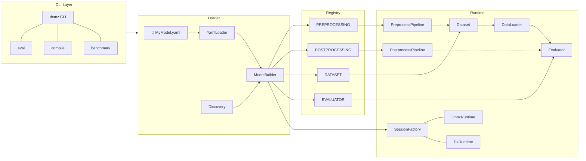
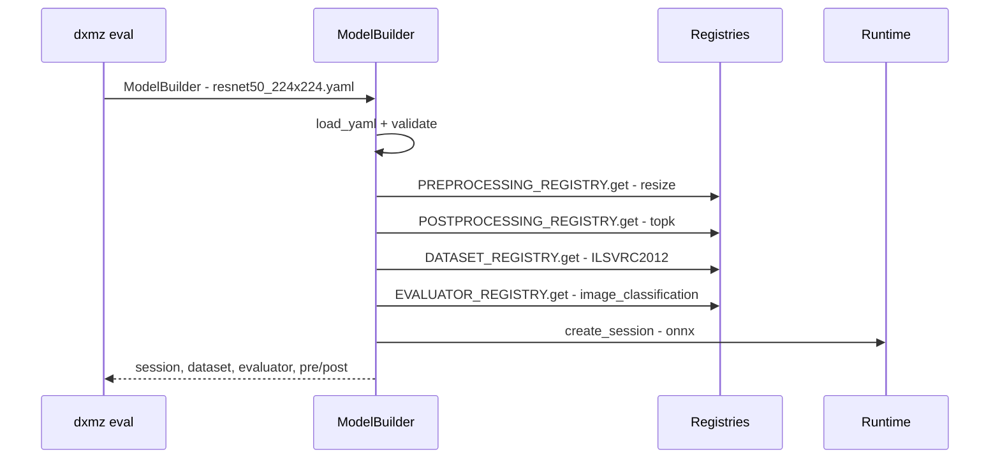
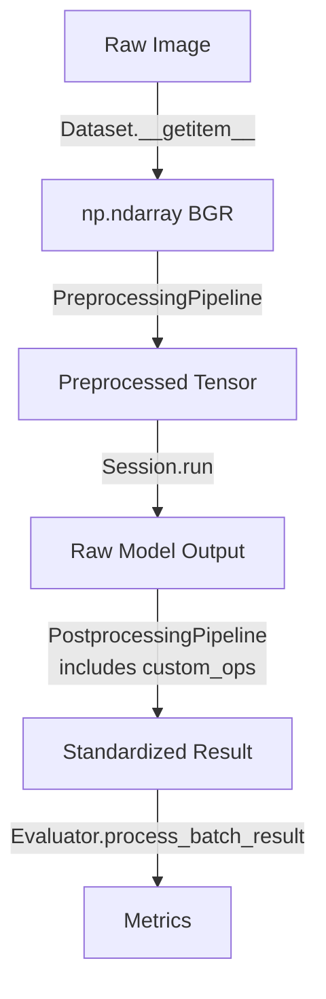

# Architecture Overview

The DX-ModelZoo architecture is designed around a YAML-centric configuration approach, where `ModelBuilder` and the Registry pattern connect all components for runtime execution.

!!! note "See Also"
    - [Pipeline](pipeline.md) - Detailed pipeline execution flow
    - [Registry](registry.md) - Registry pattern implementation details
    - [ModelBuilder](../api/model-builder.md) - ModelBuilder API reference
    - [YAML Configuration](../guides/yaml-config.md) - YAML configuration guide

## Architecture Diagram



## Core Design Principles

### YAML-Centric

Every model definition is fully self-contained within a YAML file. Preprocessing, postprocessing, datasets, and profiles are configured declaratively without writing any Python code.

```yaml
# A model is fully defined by this alone
name: resnet50_224x224
preprocessing: [...]
postprocessing: [...]
evaluator: { type: image_classification }
dataset: { type: ILSVRC2012, eval_path: ... }
profiles: { onnx: ..., q-lite: ... }
```

### Registry Pattern Everywhere

Four registries manage all extensible components:

| Registry | Role | Examples |
|----------|------|----------|
| `PREPROCESSING_REGISTRY` | Preprocessing operations | `resize`, `normalize`, `div` |
| `POSTPROCESSING_REGISTRY` | Postprocessing operations | `topk`, `nms`, `identity` |
| `DATASET_REGISTRY` | Dataset loaders | `ILSVRC2012`, `COCO`, `PascalVOC2007` |
| `EVALUATOR_REGISTRY` | Evaluation logic | `image_classification`, `object_detection` |

### Separation of Concerns: Evaluator vs. Postprocessing

A key architectural decision is the strict separation between **postprocessing** (model output decoding) and **evaluation** (metric computation):

- **Postprocessing** (`custom_ops.py` or shared `postprocessing/`): Transforms raw model tensors into a standardized, task-specific format.
- **Evaluator**: Consumes the standardized output and computes quality metrics (mAP, accuracy, AUROC, etc.).

This separation allows evaluators to be reused across models with different output formats, as long as a compatible postprocessor is defined.

### Builder Pattern

`ModelBuilder` is responsible for transforming YAML into runtime components:



## Source Directory Structure

```
src/dx_modelzoo/
├── main.py              # CLI entry point (Typer)
├── command/
│   ├── compile.py       # NPU compilation logic
│   ├── benchmark.py     # Multi-model batch evaluation
│   └── create_yaml.py   # Interactive YAML creation
├── common/
│   ├── dataloader.py    # Pure numpy DataLoader
│   ├── enums.py         # DeviceType, EvaluationType, DatasetType
│   ├── registry.py      # Registry pattern
│   ├── seed.py          # Global seed management
│   └── ...
├── preprocessing/       # 13 registered ops + pipeline
├── postprocessing/      # 4 shared ops + decode utilities
├── evaluator/           # 25 task evaluators
├── dataset/             # 30 dataset classes
├── loader/
│   ├── yaml_loader.py   # YAML parse + validation
│   ├── model_builder.py # Build all runtime objects from YAML
│   ├── model_scaffold.py# YAML creation scaffolding
│   └── discovery.py     # Model directory scanning
├── session/
│   ├── onnx_session.py  # ONNX Runtime backend
│   ├── dx_session.py    # DxRuntime (NPU) backend
│   ├── runtime_config.py# RuntimeConfig dataclasses
│   └── factory.py       # Session creation + auto-download
├── models/              # 300+ YAML model configs
└── tui/                 # Interactive model browser + wizard
```

## Data Flow

The data flow through the full evaluation process:



| Stage | Component | Data Format |
|-------|-----------|-------------|
| Load | Dataset | BGR `np.ndarray` (H, W, 3) |
| Preprocessing | PreprocessingPipeline | float32 `np.ndarray` (1, C, H, W) |
| Inference | Session | `list[np.ndarray]` (raw model outputs) |
| Postprocessing | PostprocessingPipeline + custom_ops | Task-specific standardized format |
| Evaluation | Evaluator | metrics dict |

!!! note "NPU Mode"
    When using a `target: dxnn` profile, arithmetic preprocessing operations (`div`, `normalize`, `transpose`, etc.) are automatically skipped. This is because the NPU handles these operations at the hardware level.
