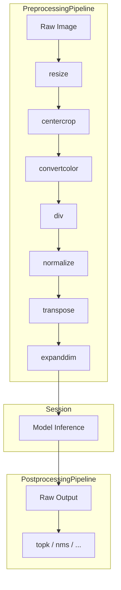
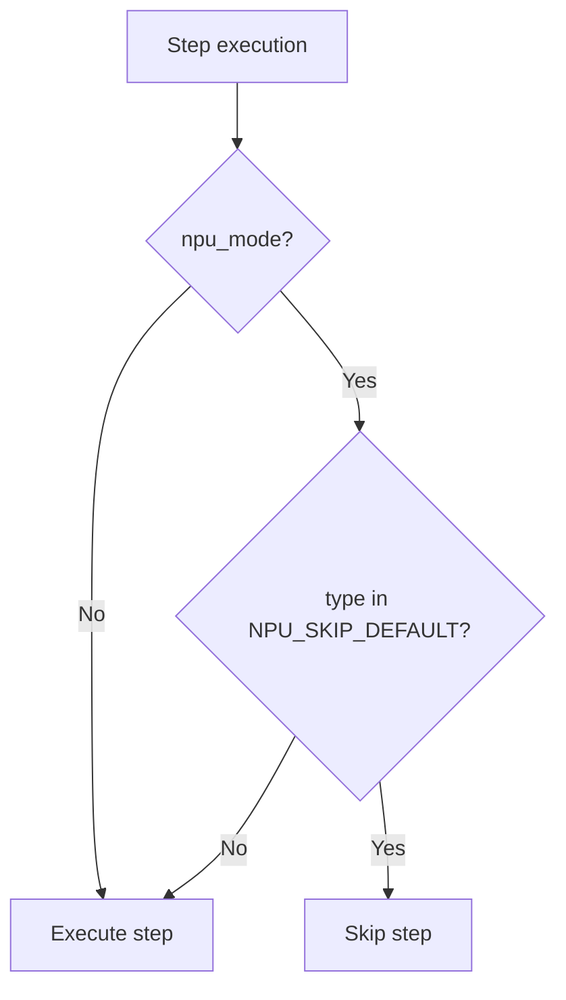
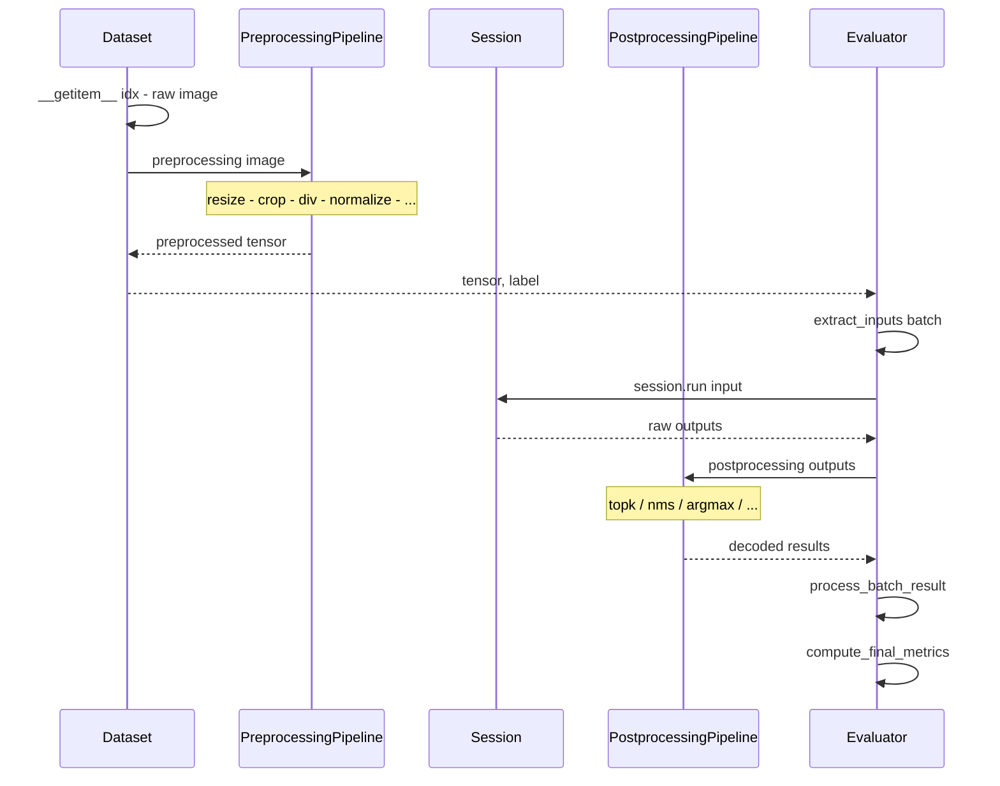

# Pipeline

The DX-ModelZoo preprocessing and postprocessing pipelines execute operations sequentially in the order defined in YAML configuration.

!!! note "See Also"
    - [Overview](overview.md) - Architecture overview and design principles
    - [Registry](registry.md) - Registry pattern and component registration
    - [Preprocessing](../api/preprocessing.md) - Preprocessing operations reference
    - [Postprocessing](../api/postprocessing.md) - Postprocessing operations reference
    - [YAML Configuration](../guides/yaml-config.md) - Pipeline configuration in YAML

## Pipeline Overview



## PreprocessingPipeline

Applies preprocessing operations sequentially to the input data (images).

### Class Structure

```python
class PreprocessingPipeline(Compose):
    """Inherits from torchvision.transforms.Compose."""

    def __init__(
        self,
        steps_config: Union[List[Dict], Dict[str, List[Dict]]],
        npu_mode: bool = False,
    ):
        # Builds steps from config dicts; skips NPU-handled ops when npu_mode=True
        ...

    def __call__(self, img: np.ndarray) -> np.ndarray:
        for step in self.steps:
            img = step(img)
        return img
```

### YAML to Pipeline Mapping

```yaml title="YAML Definition"
preprocessing:
  - type: resize
    size: [256, 256]
    mode: torchvision
  - type: centercrop
    height: 224
    width: 224
  - type: div
    x: 255
  - type: normalize
    mean: [0.485, 0.456, 0.406]
    std: [0.229, 0.224, 0.225]
  - type: transpose
    axis: [2, 0, 1]
  - type: expanddim
    axis: 0
```

The above YAML is transformed into the following:

```python
# Automatically generated by ModelBuilder
pipeline = PreprocessingPipeline(
    steps_config=[
        {"type": "resize", "size": [256, 256], "mode": "torchvision"},
        {"type": "centercrop", "height": 224, "width": 224},
        {"type": "div", "x": 255},
        {"type": "normalize", "mean": [0.485, 0.456, 0.406], "std": [0.229, 0.224, 0.225]},
        {"type": "transpose", "axis": [2, 0, 1]},
        {"type": "expanddim", "axis": 0},
    ],
    npu_mode=False,
)
```

## NPU Auto-Skip

When evaluating with a `target: dxnn` profile, arithmetic operations that the NPU handles internally are automatically skipped.

### NPU_SKIP_DEFAULT

```python
NPU_SKIP_DEFAULT = {
    "div",
    "normalize",
    "transpose",
    "expanddim",
    "mul",
    "add",
    "subtract",
}
```

### Behavior Comparison

=== "ONNX Mode (Full Execution)"

    ```
    resize → centercrop → convertcolor → div → normalize → transpose → expanddim
    ✅       ✅           ✅             ✅     ✅          ✅          ✅
    ```

    All operations are executed in order.

=== "NPU Mode (Auto-Skip)"

    ```
    resize → centercrop → convertcolor → div → normalize → transpose → expanddim
    ✅       ✅           ✅             ⏭️     ⏭️          ⏭️          ⏭️
    ```

    Operations included in `NPU_SKIP_DEFAULT` are skipped.

!!! note "Why Operations Are Skipped"
    The NPU accepts `uint8` input and handles `div` (normalization), `normalize`, `transpose` (layout conversion), and `expanddim` (batch dimension) at the hardware level. Running these operations redundantly on the CPU would produce incorrect results.

### Skip Flow



## PostprocessingPipeline

Applies postprocessing operations sequentially to the model output.

### Class Structure

```python
class PostprocessingPipeline:
    def __init__(self, steps: list):
        self.steps = steps

    def __call__(self, outputs):
        for step in self.steps:
            outputs = step(outputs)
        return outputs
```

!!! note "No NPU Skip"
    The postprocessing pipeline does not have NPU skip logic. All postprocessing operations are always executed.

### YAML to Pipeline Mapping

```yaml title="Detection Model Example"
postprocessing:
  - type: nms
    variant: yolo
```

```python
# Transformed result
pipeline = PostprocessingPipeline(
    steps=[NMS(variant="yolo")]
)
```

### Postprocessing Patterns by Task

| Task | Postprocessing Type | Description |
|------|-------------------|-------------|
| Classification | `topk` | Top-k classes |
| Detection | `nms` | Non-maximum suppression |
| Segmentation | `segmentation_argmax` | Per-pixel argmax |
| Face Detection | `face_detection` | Face bounding box decoding |
| Pose Estimation | `pose_estimation` | Keypoint decoding |
| Instance Seg | `instance_seg` | Instance masks |
| Other | `identity` | No postprocessing |

## Full Execution Flow



## Custom Pipeline Extension

To add a custom operation, register it with the appropriate Registry:

```python
from dx_modelzoo.preprocessing import PREPROCESSING_REGISTRY

@PREPROCESSING_REGISTRY.register("my_augment")
class MyAugment:
    def __init__(self, probability: float = 0.5):
        self.probability = probability

    def __call__(self, img: np.ndarray) -> np.ndarray:
        # Custom logic
        return img
```

```yaml
preprocessing:
  - type: resize
    size: [224, 224]
  - type: my_augment        # Custom operation inserted
    probability: 0.8
  - type: div
    x: 255
```

!!! note "Pipeline Debugging"
    Print the shape before and after each step's `__call__` to trace the data transformation process:
    ```python
    for step in pipeline.steps:
        print(f"{step.__class__.__name__}: {img.shape}", end=" → ")
        img = step(img)
        print(img.shape)
    ```
