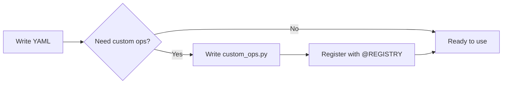
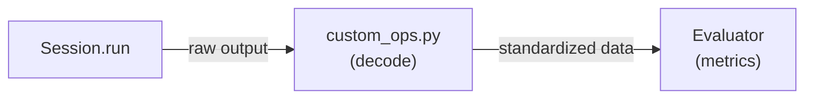

# Custom Models

This guide explains how to add a new model to DX-ModelZoo. All you need is a single YAML file and, optionally, custom preprocessing/postprocessing operations.

!!! note "Prerequisites"
    Before creating custom models, make sure you have:

    - [Installed DX-ModelZoo](../getting-started/installation.md) with development dependencies
    - Basic understanding of [YAML configuration](yaml-config.md)
    - Model file in ONNX format (or other supported formats)
    - Familiarity with preprocessing/postprocessing concepts

!!! note "See Also"
    - [YAML Configuration](yaml-config.md) - Complete YAML reference
    - [Model Evaluation](evaluation.md) - How to evaluate your custom model
    - [Custom Datasets](custom-datasets.md) - Create custom datasets for your model

## Overview



## Step 1: Creating YAML File

Model YAML files are organized by domain, task, and model family:

**Directory structure:**
```
src/dx_modelzoo/models/
└── <domain>/          # e.g., cv, nlp, audio
    └── <task>/        # e.g., image_classification, object_detection
        └── <Family>/  # e.g., ResNet, EfficientNet
            └── <ModelName>.yaml
```

**Example:**
```
src/dx_modelzoo/models/
└── cv/
    └── image_classification/
        └── MyModel/
            └── MyModel_v1.yaml    ← create here
```

### Environment Variables in YAML

DX-ModelZoo supports environment variable substitution in YAML files:

| Variable | Description | Example |
|----------|-------------|---------||
| `${DATA_ROOT}` | Dataset root directory | `/data/datasets` |
| `${MODEL_ROOT}` | Model artifacts root | `/data/models` |
| `${MODEL_NAME}` | Current model name | `MyModel_v1` |
| `${DXMZ_MODEL_URL}` | Auto-download server URL | `https://sdk.deepx.ai/modelzoo` |

For more details, see [YAML Configuration](yaml-config.md#environment-variable-substitution).

### Minimal YAML Example

```yaml title="MyModel_v1.yaml"
name: MyModel_v1
task: image_classification
reference: https://arxiv.org/abs/xxxx.xxxxx
description: >
  My custom classification model

inputs:
  - name: input
    shape: [1, 3, 224, 224]
    dtype: float32
    layout: NCHW

preprocessing:
  - type: resize
    size: [256, 256]
    mode: torchvision
    interpolation: BILINEAR
  - type: centercrop
    height: 224
    width: 224
  - type: convertcolor
    form: BGR2RGB
  - type: div
    x: 255
  - type: normalize
    mean: [0.485, 0.456, 0.406]
    std: [0.229, 0.224, 0.225]
  - type: transpose
    axis: [2, 0, 1]
  - type: expanddim
    axis: 0

postprocessing:
  - type: topk
    k: [1, 5]

evaluator:
  type: image_classification

dataset:
  type: ILSVRC2012
  eval_path: ${DATA_ROOT}/ILSVRC2012/val

artifacts:
  path: ${MODEL_ROOT}/${MODEL_NAME}

profiles:
  onnx:
    target: onnx
    runtime:
      device: gpu
      batch_size: 1
  q-lite:
    target: dxnn
    compile:
      quantization:
        lite:
          num_samples: 100
          method: ema
    runtime:
      device: 0
      async: true
  q-pro:
    target: dxnn
    compile:
      quantization:
        pro:
          num_samples: 100
          method: ema
    runtime:
      device: 0
      async: true
```

!!! note "Leverage Built-in Types"
    When using built-in types for preprocessing, postprocessing, datasets, and evaluators, the model can be fully defined in YAML alone — no Python code required.

## Step 2: Custom Operations

If the built-in types are insufficient, create a `custom_ops.py` file in the **same directory as your model YAML**:

```
src/dx_modelzoo/models/
└── cv/
    └── image_classification/
        └── MyModel/
            ├── MyModel_v1.yaml
            └── custom_ops.py      ← create here
```

### Custom Preprocessing

```python title="custom_ops.py"
import numpy as np
from dx_modelzoo.preprocessing import PREPROCESSING_REGISTRY


@PREPROCESSING_REGISTRY.register("my_letterbox")
class MyLetterbox:
    """Aspect-ratio-preserving resize with padding"""

    def __init__(self, target_size: list[int], pad_value: int = 114):
        self.target_size = tuple(target_size)  # (H, W)
        self.pad_value = pad_value

    def __call__(self, img: np.ndarray) -> np.ndarray:
        h, w = img.shape[:2]
        th, tw = self.target_size
        scale = min(tw / w, th / h)
        new_w, new_h = int(w * scale), int(h * scale)

        import cv2
        resized = cv2.resize(img, (new_w, new_h))
        canvas = np.full((th, tw, 3), self.pad_value, dtype=np.uint8)
        top = (th - new_h) // 2
        left = (tw - new_w) // 2
        canvas[top:top + new_h, left:left + new_w] = resized
        return canvas
```

### Custom Postprocessing

```python title="custom_ops.py (continued)"
from dx_modelzoo.postprocessing import POSTPROCESSING_REGISTRY


@POSTPROCESSING_REGISTRY.register("my_decode")
class MyDecode:
    """Custom decoding logic"""

    def __init__(self, conf_threshold: float = 0.25):
        self.conf_threshold = conf_threshold

    def __call__(self, outputs: list[np.ndarray]) -> dict:
        predictions = outputs[0]
        mask = predictions[..., 4] > self.conf_threshold
        return {"detections": predictions[mask]}
```

### Using Custom Operations in YAML

```yaml title="MyDetector.yaml"
preprocessing:
  - type: my_letterbox          # custom type
    target_size: [640, 640]
    pad_value: 114
  - type: div
    x: 255
  - type: transpose
    axis: [2, 0, 1]
  - type: expanddim
    axis: 0

postprocessing:
  - type: my_decode             # custom type
    conf_threshold: 0.3
```

!!! note "Auto-Import"
    `custom_ops.py` placed in the same directory as the model YAML is automatically imported by `ModelBuilder`. No manual import is needed — just define your classes with `@REGISTRY.register()` and they become available in the YAML configuration.

## Step 3: Verification

```bash
# Run by model name
dxmz eval MyModel_v1 --profile onnx

# Expected output:
# Loading model: MyModel_v1
# Dataset: ILSVRC2012 (50000 samples)
# Evaluating... [============================] 100%
# Top-1 Accuracy: 76.13%
# Top-5 Accuracy: 92.86%
# FPS: 245.3

# Run with dataset path override
dxmz eval MyModel_v1 --profile onnx --data-root /path/to/datasets

# Run by YAML path
dxmz eval path/to/MyModel_v1.yaml --profile onnx

# Specify model file directly
dxmz eval MyModel_v1 --profile onnx --model-path /path/to/model.onnx
```

## Complete Example

A full custom detection model configuration:

```yaml title="models/cv/detection/MyDet/MyDet_s.yaml"
name: MyDet_s
task: object_detection
reference: https://github.com/my-org/mydet
description: >
  Lightweight object detection model (COCO mAP 42.1)

inputs:
  - name: images
    shape: [1, 3, 640, 640]
    dtype: float32
    layout: NCHW

preprocessing:
  - type: my_letterbox
    target_size: [640, 640]
  - type: convertcolor
    form: BGR2RGB
  - type: div
    x: 255
  - type: transpose
    axis: [2, 0, 1]
  - type: expanddim
    axis: 0

postprocessing:
  - type: my_decode
    conf_threshold: 0.25

evaluator:
  type: object_detection

dataset:
  type: COCO
  eval_path: ${DATA_ROOT}/COCO/official

artifacts:
  path: ${MODEL_ROOT}/${MODEL_NAME}

profiles:
  onnx:
    target: onnx
    runtime:
      device: gpu
  q-lite:
    target: dxnn
    compile:
      quantization:
        lite:
          num_samples: 100
          method: ema
    runtime:
      device: 0
      async: true
  q-pro:
    target: dxnn
    compile:
      quantization:
        pro:
          num_samples: 100
          method: ema
    runtime:
      device: 0
      async: true
```

## Model-Specific Evaluator Integration

For models that require custom decoding of model outputs (e.g., pose estimation, text detection), the recommended pattern is:

1. Define the decoder in `custom_ops.py` with `@POSTPROCESSING_REGISTRY.register()`
2. Reference it in the YAML `postprocessing` section
3. The evaluator receives the decoded output in `process_batch_result()`



### Example: Full Pipeline

```python title="models/cv/text_detection/PP_OCRv5_Det/custom_ops.py"
@POSTPROCESSING_REGISTRY.register("db_text_decode")
class DBTextDecode:
    """Binarise DB probability map → list of polygon arrays."""
    def __init__(self, db_thresh=0.3, db_box_thresh=0.5, **kwargs):
        self.db_thresh = db_thresh
        self.db_box_thresh = db_box_thresh

    def __call__(self, outputs, **kwargs):
        prob_map = outputs[0]
        # ... decode logic ...
        return polygons  # List[np.ndarray [4,2]]
```

```yaml title="PP_OCRv5_Det.yaml"
postprocessing:
  - type: db_text_decode
    db_thresh: 0.3
    db_box_thresh: 0.5

evaluator:
  type: text_detection
```

The `TextDetectionEvaluator` then receives `polygons` directly and only computes IoU-based precision/recall metrics.

### Pipeline Evaluators (Multi-Model)

Some evaluators orchestrate multiple models (e.g., OCR = Detection + Recognition). In these cases:

- The evaluator manages session lifecycle and data flow
- Each model's decode logic still lives in its respective `custom_ops.py`
- The evaluator calls postprocessors explicitly via lazy-init imports

```python
# Inside OCR Evaluator (simplified)
def process_batch_result(self, batch_data, output, metrics_state):
    # Det model output → polygons (via custom_ops)
    polygons = self._get_db_decoder()([output])

    for poly in polygons:
        crop = extract_crop(image, poly)                    # evaluator logic
        rec_input = self._get_rec_preprocessor()(crop)      # custom_ops
        rec_output = self.rec_session.run(rec_input)        # session
        text = self._get_ctc_decoder()(rec_output)          # custom_ops

    # Compute Deteval metrics (evaluator logic)
    ...
```

## Troubleshooting

| Item | Check |
|------|-------|
| Is the YAML file located under `models/<domain>/<task>/<Family>/`? | ✅ |
| Does the `name` field match the filename? | ✅ |
| Do the `inputs` shape/dtype match the model? | ✅ |
| Are custom ops registered with `@REGISTRY.register()`? | ✅ |
| Is `custom_ops.py` in the same directory as the YAML? | ✅ |
| Are custom postprocessors receiving `**kwargs`? | ✅ |
| Are the required runtimes defined in `profiles`? | ✅ |
| Does `dxmz eval` run successfully? | ✅ |
