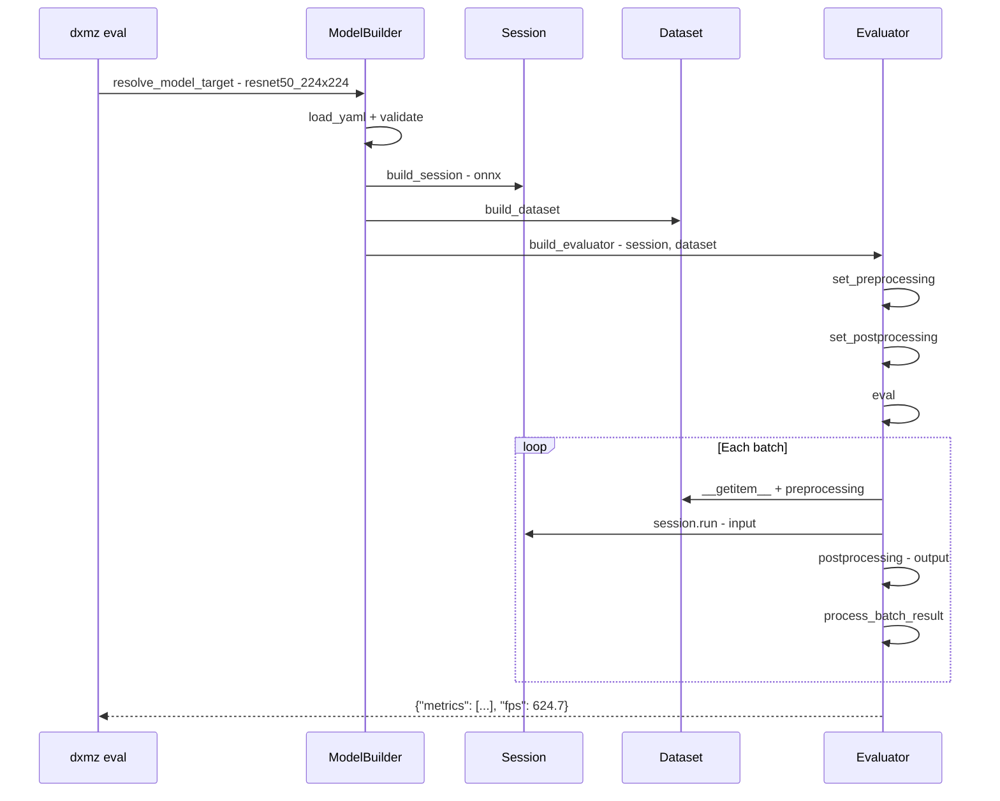

# Model Evaluation

This guide provides a comprehensive overview of model evaluation in DX-ModelZoo, covering evaluation workflows, options, and advanced usage patterns.

!!! note "Prerequisites"
    Before evaluating models, make sure you have [installed DX-ModelZoo](../getting-started/installation.md) and reviewed the [Quick Start guide](../getting-started/quickstart.md).

!!! note "See Also"
    - [Quick Start](../getting-started/quickstart.md) - Basic evaluation commands
    - [YAML Configuration](yaml-config.md) - Configure evaluation in YAML
    - [Datasets](datasets.md) - Supported datasets
    - [CLI Reference](../api/cli.md) - CLI command reference

## Basic Usage

```bash
dxmz eval <model_name> --profile <profile> --seed 42
```

## Evaluation Flow



## Evaluation Options

```bash
dxmz eval resnet50_224x224 --profile onnx \
  --data-root /data/datasets \       # Override DATA_ROOT (required if env var is not set)
  --model-root /data/models \        # Override MODEL_ROOT (required if env var is not set)
  --model-path /path/to/model.onnx \ # Specify model file directly
  --seed 42 \                        # Reproducible evaluation
  --save                             # Save JSON to result/<model>_<profile>_<timestamp>.json
```

Multiple models can be evaluated in one command:

```bash
# Evaluate multiple models sequentially
dxmz eval resnet50_224x224 MobileNetV2 --profile onnx --seed 42
# Results are saved separately for each model when --save is used
```

## Sync vs Async Evaluation

The evaluator automatically selects the mode based on the session's async support:

=== "Sync Mode"

    ```
    for batch in dataloader:
        output = session.run(input)       # Synchronous inference
        postprocessing(output)
        update_metrics()
    ```

    - Default mode
    - Used with ONNX Runtime

=== "Async Mode"

    ```
    sliding window (queue_size = workers × device_count):
        session.run_async(input)          # Async inference request
        output = session.wait(job_id)     # Wait for result
        postprocessing(output)
        update_metrics()
    ```

    - Automatically enabled for DxRuntime (NPU)
    - Pipeline optimization maximizes throughput

## Batch Size

ONNX profiles support adjustable `batch_size`:

```yaml title="resnet50_224x224.yaml"
profiles:
  onnx:
    target: onnx
    runtime:
      device: gpu
      batch_size: 4    # Batch size 4
```

!!! warning "dxnn Profiles"
    Profiles with `target: dxnn` are always forced to `batch_size=1`. Any other value set in the YAML is ignored.

## Result Format

```json
{
  "model": "resnet50_224x224",
  "dataset": "imagenet",
  "metrics": [
    {"name": "Top-1", "metric_value": 69.76},
    {"name": "Top-5", "metric_value": 89.08}
  ],
  "fps": 624.7,
  "elapsed_time": 82,
  "start_time": "2026-07-23 14:30:00",
  "profile": "onnx"
}
```

!!! note "FPS Calculation"
    FPS (Frames Per Second) is calculated as: `total_images / inference_time`

    - Excludes data loading time
    - Includes preprocessing and postprocessing

## Time Breakdown

A time breakdown is automatically printed after evaluation:

```
Time breakdown — load: 12.3s (15%) | infer: 65.2s (79%) | post: 4.8s (6%)
```

| Phase | Description |
|-------|-------------|
| `load` | Data loading + preprocessing time |
| `infer` | Model inference time |
| `post` | Postprocessing + metric update time |

## Built-in Evaluators

| Evaluator | Task | Metrics |
|-----------|------|---------|
| `image_classification` | Classification | Top-1, Top-5 Accuracy |
| `object_detection` | Detection (COCO/VOC) | mAP@0.5, mAP@0.5:0.95 |
| `semantic_segmentation` | Segmentation | mIoU |
| `depth_estimation` | Depth | δ < 1.25, RMSE |
| `pose_estimation` | Pose | AP, AR |
| `face_landmark` | Landmark | NME |
| `face_recognition` | Face verification | Accuracy |
| `super_resolution` | Super resolution | PSNR |
| `oriented_object_detection` | Oriented detection | mAP |
| `zero_shot_image_classification` | Zero-shot | Top-1 Accuracy |
